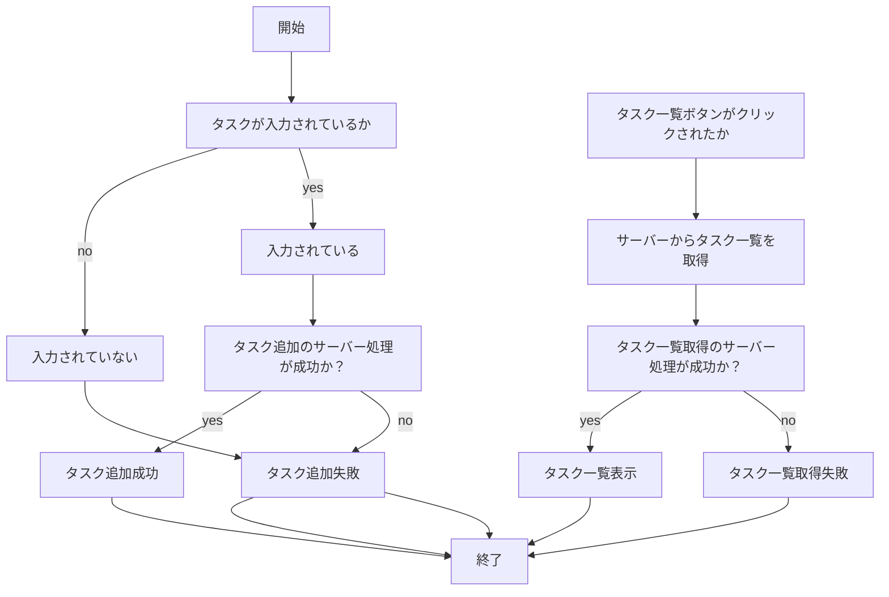

# タスク追加・一覧取得のフローチャート

```mermaid
flowchart TD;
start["開始"]
  check_task_input["タスクが入力されているか"]
  input_empty["入力されていない"]
  input_filled["入力されている"]
  check_server_response_add["タスク追加のサーバー処理が成功か？"]
  result_add_success["タスク追加成功"]
  result_add_error["タスク追加失敗"]
  check_list_button_clicked["タスク一覧ボタンがクリックされたか"]
  get_tasks_from_server["サーバーからタスク一覧を取得"]
  check_server_response_get["タスク一覧取得のサーバー処理が成功か？"]
  result_get_success["タスク一覧表示"]
  result_get_error["タスク一覧取得失敗"]
  end1["終了"]

start --> check_task_input
check_task_input -->|no| input_empty
check_task_input -->|yes| input_filled
input_empty --> result_add_error --> end1
input_filled --> check_server_response_add
check_server_response_add -->|yes| result_add_success --> end1
check_server_response_add -->|no| result_add_error --> end1
check_list_button_clicked --> get_tasks_from_server
get_tasks_from_server --> check_server_response_get
check_server_response_get -->|yes| result_get_success --> end1
check_server_response_get -->|no| result_get_error --> end1
```