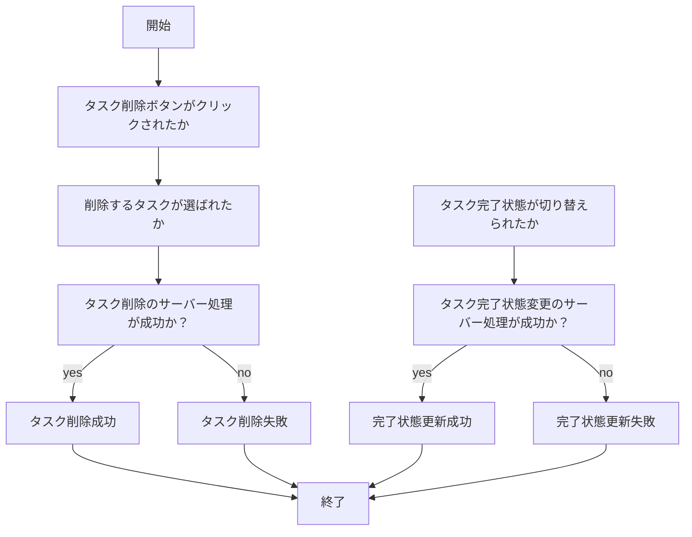

# タスク削除・完了状態変更のフローチャート

```mermaid
flowchart TD;

start["開始"]
  check_task_delete["タスク削除ボタンがクリックされたか"]
  task_selected_to_delete["削除するタスクが選ばれたか"]
  check_server_response_delete["タスク削除のサーバー処理が成功か？"]
  result_delete_success["タスク削除成功"]
  result_delete_error["タスク削除失敗"]
  check_task_completion_toggle["タスク完了状態が切り替えられたか"]
  check_server_response_toggle["タスク完了状態変更のサーバー処理が成功か？"]
  result_toggle_success["完了状態更新成功"]
  result_toggle_error["完了状態更新失敗"]
  end1["終了"]

start --> check_task_delete
check_task_delete --> task_selected_to_delete
task_selected_to_delete --> check_server_response_delete
check_server_response_delete -->|yes| result_delete_success --> end1
check_server_response_delete -->|no| result_delete_error --> end1
check_task_completion_toggle --> check_server_response_toggle
check_server_response_toggle -->|yes| result_toggle_success --> end1
check_server_response_toggle -->|no| result_toggle_error --> end1
```