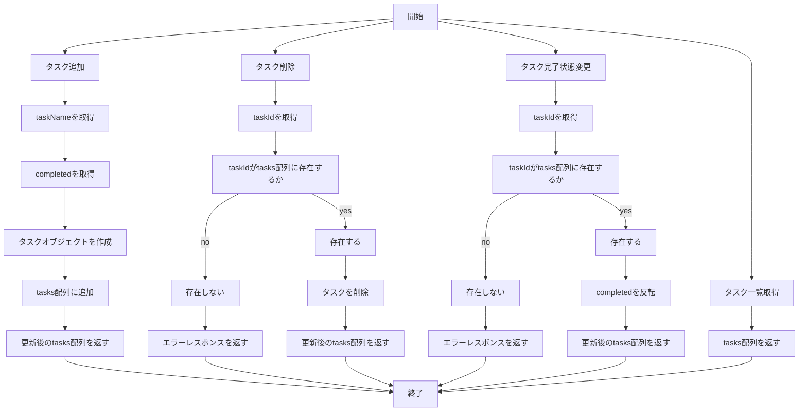

# フローチャート

```mermaid
flowchart TD;

start["開始"]
    
    add_task["タスク追加"]
    add_task_name["taskNameを取得"]
    add_task_completed["completedを取得"]
    add_task_create["タスクオブジェクトを作成"]
    add_task_push["tasks配列に追加"]
    add_task_response["更新後のtasks配列を返す"]
    
    delete_task["タスク削除"]
    delete_task_id["taskIdを取得"]
    delete_task_check["taskIdがtasks配列に存在するか"]
    delete_task_exists["存在する"]
    delete_task_remove["タスクを削除"]
    delete_task_not_found["存在しない"]
    delete_task_error_response["エラーレスポンスを返す"]
    delete_task_response["更新後のtasks配列を返す"]
    
    toggle_task["タスク完了状態変更"]
    toggle_task_id["taskIdを取得"]
    toggle_task_check["taskIdがtasks配列に存在するか"]
    toggle_task_exists["存在する"]
    toggle_task_toggle["completedを反転"]
    toggle_task_not_found["存在しない"]
    toggle_task_error_response["エラーレスポンスを返す"]
    toggle_task_response["更新後のtasks配列を返す"]
    
    get_tasks["タスク一覧取得"]
    get_tasks_response["tasks配列を返す"]
    
    end1["終了"]
    
start --> add_task
add_task --> add_task_name
add_task_name --> add_task_completed
add_task_completed --> add_task_create
add_task_create --> add_task_push
add_task_push --> add_task_response
add_task_response --> end1

start --> delete_task
delete_task --> delete_task_id
delete_task_id --> delete_task_check
delete_task_check -->|yes| delete_task_exists
delete_task_exists --> delete_task_remove
delete_task_remove --> delete_task_response
delete_task_check -->|no| delete_task_not_found
delete_task_not_found --> delete_task_error_response
delete_task_error_response --> end1
delete_task_response --> end1

start --> toggle_task
toggle_task --> toggle_task_id
toggle_task_id --> toggle_task_check
toggle_task_check -->|yes| toggle_task_exists
toggle_task_exists --> toggle_task_toggle
toggle_task_toggle --> toggle_task_response
toggle_task_check -->|no| toggle_task_not_found
toggle_task_not_found --> toggle_task_error_response
toggle_task_error_response --> end1
toggle_task_response --> end1

start --> get_tasks
get_tasks --> get_tasks_response
get_tasks_response --> end1
```